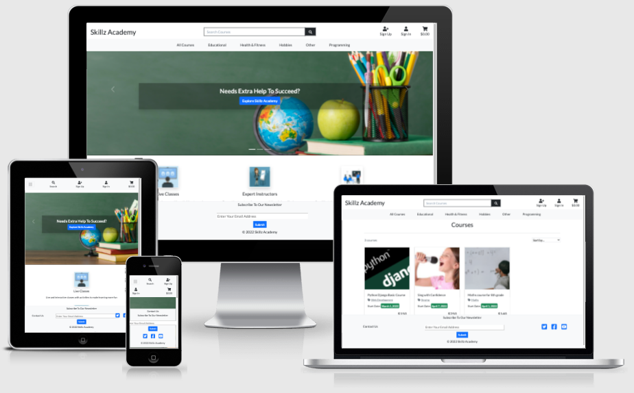

** Welcome to [Skillz Academy](https://skillz-academy.herokuapp.com/)** !

Welcome to **[Skillz Academy](https://skillz-academy.herokuapp.com/)**, website to develop your skills, learn new skills and hobbies just by form your home. This site will connect worldwide experts from different areas to the who can provide online courses in different areas.

For live website [click here](https://skillz-academy.herokuapp.com/)

For the GitHub repository [click here](https://github.com/rajendradanve/skillzacademy)

##   **Table of Content**

 1. [About](#About)
 2. [UX](#UX)
    *   [Project Goals](#project-goals)
    *   [Targeted Audience](#targeted-audience)
    *   [User Goals](#user-goals)
    *   [Developer Goals](#developer-goals)
    *   [User Stories](#user-stories)
    *   [Scope](#scope)
    *   [Structure](#structure)
    *   [Design Choice](#design-choice)
    *   [Wireframes](#wireframes)

 2. [Features](#features)
    *   [Existing Features](#existing-features)
    *   [Features Left to Implement](#features-left-to-implement)

3.  [Technologies Used](#technologies-used)
    *   [Languages Used](#languages-used)
    *   [Frameworks, Libraries, Programs and Tools Used](#frameworks-libraries-programs-and-tools-used)
   
4. [Mongodb Database](#mongodb-database) 

5. [Testing](#testing)

5. [Deployment](#deployment)

6. [Credits](#credits)

7. [Acknowledgements](#acknowledgements)

# **About**
This is my fourth milestone project for the fullstack development course conducted by [Code Institute](https://codeinstitute.net/global/). For this project, I made a website [Skillz Academy](https://skillz-academy.herokuapp.com/) This website will help student to develop new skills, hobbies or find some extra help in education. 
This site is useful for wide range of group but main target group is teenage and young people.
Users of this website can browse different categories get details regarding course and instructor and buy the course. Purpose of this project to exhibit kwnoldege learned during study of Django framework. 

The webiste design is kept simple and straight forward as this can be used by wide range of users. 
Users can go through different categories which will show him list of courses. User can go through details of the perticular course and then proceed with purchase by adding course to the cart. 

# **UX**

##  **Project Goals**
The goal of this website to connect instructor and intrested students.
Though currently there are many websites which shows recorded videos, it is always better to learn live and ask questions to live instructor.
Currently market is so demanding and people wanted to learn something new, upgrade themselves or want to change the path and relax by learning new hobbies. 
Users of this site can explore different courses based on their intrest.
Website is showing different categories to find the course easily.
Course details provides all the required information to the user and based on this informaition user can buy the course. Only register user can bought the course and they will get meeting links in the the course detail page. 
Admin has possibility to add, edit different categories. Add, edit, and delete course. 

## **Targeted Audience**
This website can be used by variety of users who want to learn, extent skills or learn new hobbies.
This website can be used by
- College student or young professional who wants to develop there skills or learn hobbies.
- Group who want to learn something new or develop new hobbies. 
- Parents who want to improve who want their kids to improve in education, develop new skills or hobbies.

## **User Goals**

**Goal for Non-register Users**

*   Simple webpage layout
*   Get a basic idea about from the home page what is this website about. 
*   Visible important categories and dropdown sub categories to find courses easily.
*   Getting all information about the course before buying it. 

**Goal for Register Users**

*   Good and simple page layout for all pages which is suitable for all kinds of users.
*   Able to explore courses same as non-register user.  
*   Buy courses with simple payment process.
*   See all purchase history about the courses. 
*   Page to view all paid courses to access meeting link.

**Goal for Admin**

*   Admin has similar goals as register user but has some extra functionality
*   Admin shall ableto add/ edit/ delete course
*   Admin can add / edit main categories and categories
*   Admin has possibility add/edit discount and offer for the user.

## **Developer Goals**

* Shows developer's understanding of full stack development using Django framework
* Design website for broad range of users with simple and user friendly layout
* Develop responsive website suitable for all types of screens such as desktop, tablet and mobile.

## **User Stories**

### **Non-register User**
* As a non-registered user, I shall be able to access all the courses available on [Skillz Academy](https://skillz-academy.herokuapp.com/)
* As a non-registered user, I shall be able to get all information realted to the course before registering for the course. 
* As a non-registered user, I shall be able to add courses in the cart so that my courses to purchase gets saved before creating user account
* As a non-register user, I shall be able to create my user account easily with minimum details. 

### **Registered User**

* As a registered user, I shall be able to sign in and sign out of the site successfully.
* As a registered user, I shall be able to access all pages meant for registered users.
* As a registered user, I shall be able to buy the courses added in the bag. 
* As a registered user, I shall be able to get history of my purchases.
* As a registered user, I shall be able to access courses I purchased.
* As a registered user, I shall get information of the course schedule and link to attend the meeting. 

### **Admin**

* As an admin, I shall be able to sign in and sign out of the site successfully.
* As an admin, I shall be able to access all pages.
* As an admin, I shall be able to add, edit or delete course. 
* As an admin, I shall be able to add, update course schedule.
* As an admin, I shall be able to add applicable discount.
* As an admin, I shall be able to add, edit Main Categories and Sub Categoreries.

## **Scope**

Aim of developing [Skillz Academy](https://skillz-academy.herokuapp.com/) is to exhibit understanding of full stack development using modern framework.
Project I decided to do is huge and with lot of possibilities and improvements which requires more advance coading and time. But due to time constraint I decided to focus developing Minimum Viable Product (Minimum Viable Product). This will allow me to work on basic functionality which shows my understanding and capability of full stack development. 
So I limited scope for this website as 
- Create a simple but useful website.
- Create medimum level of UX but still responsive and user friendly.
- Meet the requirements of most of the user stories.

Website included minimum of 
- A navbar on all the pages through out the website for easily navigating to different pages on different devices.
- A footer on all the pages through out the website which includes social media links, subscription form and contact us form. 
- Card layout for showing all the coures with important information
- Simple layout for showing all details of the course with all important information.
- Simple management options for admin which helps him to add, edit , update courses, categories etc. 

## **Structure**
Below provided structure for the important pages. 
### **General For All Pages**
There will be fully responsive navbar with full width. There will be two navbars one is main nav bar and other is top navbar.
Top navbar will consist of links to sign in, sign up user profile and cart and main navbar which is also collasable will consist of dropdown categories.
All pages will have footer which will be at the bottom and will contain social media links, subscription form and contact us link. 

### **Home Page**
Basic template for the home page is taken from the [bootstrap carousel example](https://getbootstrap.com/docs/5.1/examples/carousel/). Aim of this page is to serve as main marketing page which has carousel, features marketing text with image. 

### **Courses Page**
This page will show all the coures and also based on category selection, search critetia and sorting options. To show the course card layout will be used with imporant details sucha as course name, category, price, start date so that user will get quick overview of the course. This page will also show search results. 

### **Courses Detail Page**
This page will show all important information about the course. Main information will be shown at top which contains course name, price, category, start date, number of lectures along with option to add course to the cart. Below it will have tabs showing all the important information about the course including course schedule.

### **My Courses Page**
This page will show courses register user purchased. This is has same layout as courses page.

### **Purchase History Page**
This page will show user all the histroy of purchases made by the user with date of purchase and cost. 
This will also has a link of to order  history which will show more details related to order. 

### **Admin Management Page**
This page is providing options for the admin to add course, add and update categories and add discount information. 

### **Cart Page**
Cart Page is showing all the courses in the cart with cost. There will be link to remove the course from the cart. 

### **Checkout Page**
Checkout Page will have all order information and form to add card details to start the payment. Most of the layout and design for this page is similar to [Boutique Ado Project](https://github.com/Code-Institute-Solutions/boutique_ado_v1/tree/250e2c2b8e43cccb56b4721cd8a8bd4de6686546) from [Code Institute](https://codeinstitute.net/global/)

## **Design Choice**

### **Framework**

[Skillz Academy](https://skillz-academy.herokuapp.com/) used [bootstrap](https://getbootstrap.com/) version 5.1 for its design
Bootstrap is most popular and widely used mobile-first design framework giving many different possibilities UX possibilities.

### **Colour Scheme**

For [Skillz Academy](https://skillz-academy.herokuapp.com/) site mostly black and white colors are used. To make it easy standard bootstrap colours are used. Major bootstrap classed used are related to dark, light primary, and success colors. More details about these colors can be found at [bootstrap color page](https://getbootstrap.com/docs/5.1/customize/color/)

### **Typography**

For this website 'Lato' font is used with sans-serif as a backup font. Font is downloaded from [google fonts](https://fonts.google.com/)

### **APPS and Pages **

Complete project is build using following apps and pages.

  - home: 
    - Homepage

  - courses: 
    - courses
    - course detail
    - add course/update course 
    - add course schedule
    - add main category
    - update main category
    - add category
    - update category

  - bag:
    - bag

  - checkout
    - checkout
    - checkout success

  - user_profile:
    - admin page
    - discount setting page
    - my courses
    - purchase history

  - contact_us
    - contact us

    
    Apart from this standard Allauth templates were upadated to suits the UX of the website.

## **Wireframe** 

Refer to the below files for basic wireframe design created for different screen sizes. There are some changes with respect to actual website during the development and to work with functionality. 

* [Desktop Wireframe](media/wireframe/Skillz-Academy-DesktopWireframe.pdf)

* [Tablet Wireframe](media/wireframe/Skillz-Academy-TabletWireframe.pdf)

* [Mobile Wireframe](media/wireframe/Skillz-Academy-MobileWireframe.pdf)

# **Features**

## **Existing Features**

- Showing courses category wise
- Possibility to add new courses and course schedule. 
- Register new user with minimum inputs.
- User able to search the course and sort it based on price, alphabatically, category namewise.
- User able to get overview of the course on one page.
- User able to see details and course schedule.
- User able to purchase course by adding minimum information. 
- User able to see purchased courses and order history from the profile page.
- Admin able to delete, edit courses and course schedule.
- Admin able to add and update main categories and sub categories.
- Admin able to update discount and also on and off the discount. 

## **Features Left to Implement**

- Allow user to add courses to wishlist
- Showing user upcoming scheduled course when he login
- Instead of admin adding book,Instructor shall able to add his book and admin shall just approve or disapprove course.
- Sending contact us 

--------To be verified---------------
# **Credits**

**Images**

The main page library image is taken from [Pexels](https://www.pexels.com/photo/row-of-books-in-shelf-256541/)

**Text**

Text for the added book is mostly taken from [Amazon](https://www.amazon.com/).

Ideas for book categories, age groups are taken from [Book Depository](https://www.bookdepository.com/).
**Code**

- [W3schools](https://www.w3schools.com/) 

  Used in general to solve issues related to HTML and CSS.
 
- [Materializecss](https://materializecss.com/)

  Mostly materializecss card component is used for this website. 

- [Jquery](https://jquery.com/)

  jquery code is used as required by materializecss.

- [MDN Resources](https://developer.mozilla.org/en-US/docs/Web/Reference)

    MDS resources are used to get more understanding of some concepts and some regular help

- [Google Fonts](https://fonts.google.com/)
   
   Roboto font link from google fonts used all over the site.

- HTML and CSS for star rating is taken from this [Youtube Video](https://www.youtube.com/watch?v=zDHC4r5eCdY)

# **Acknowledgements**

I would like to thank:

- My mentor Akshat Garg for his encouragement and valuable comments for this project. 
Thanks to his guidance and tips to improve my code.

- Lessons from code mainly mini projects on backend development institute helped a lot during this project. Used regularly to check if I am following the correct method of coding.

- Help from in the Slack community.

- Code Institute Tutor support .

Should you have any queries please reach me at rajendradanve@gmail.com.