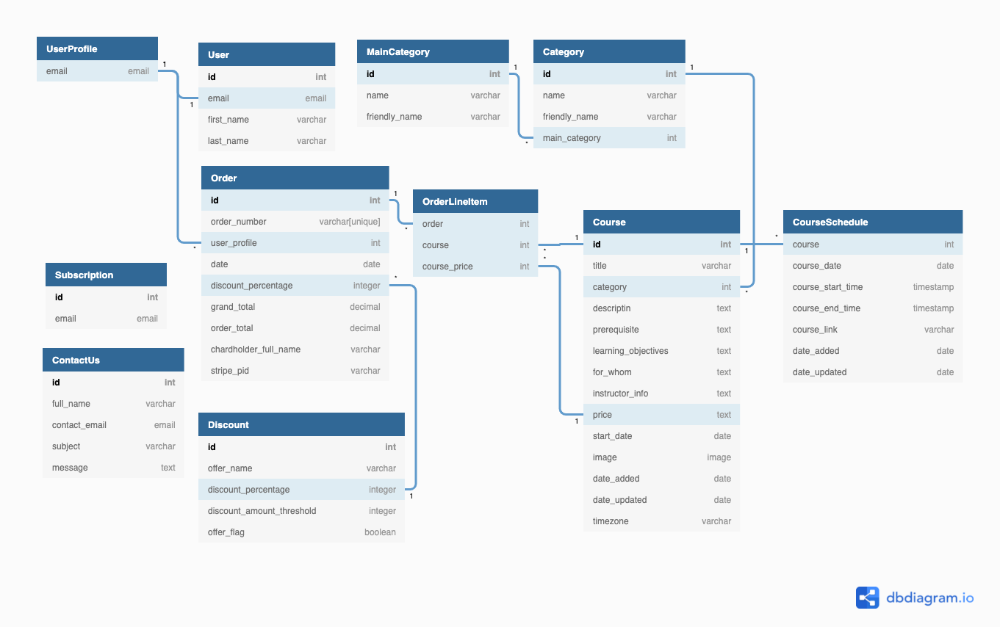

# Welcome to [Skillz Academy](https://skillz-academy.herokuapp.com/) !


Welcome to **[Skillz Academy](https://skillz-academy.herokuapp.com/)**, website to develop your skills, learn new skills and hobbies just by form your home. This site will connect worldwide experts from different areas to the who can provide online courses in different areas.

**For live website [click here](https://skillz-academy.herokuapp.com/)**

**For the GitHub repository [click here](https://github.com/rajendradanve/skillzacademy)**


##   **Table of Content**

1. [About](#About)
2. [UX](#UX)
    *   [Project Goals](#project-goals)
    *   [Targeted Audience](#targeted-audience)
    *   [User Goals](#user-goals)
    *   [Developer Goals](#developer-goals)
    *   [User Stories](#user-stories)
    *   [Scope](#scope)
    *   [Structure](#structure)
    *   [Design Choice](#design-choice)
    *   [Wireframes](#wireframes)

3. [Features](#features)
    *   [Existing Features](#existing-features)
    *   [Features Left to Implement](#features-left-to-implement)

4.  [Technologies Used](#technologies-used)
    *   [Languages Used](#languages-used)
    *   [Frameworks, Libraries, Programs and Tools Used](#frameworks-libraries-programs-and-tools-used)
   
5. [Database Schema](#database-schema) 

6. [Testing](#testing)

7. [Deployment](#deployment)

8. [Credits](#credits)

9. [Acknowledgements](#acknowledgements)

# **About**
This is my fourth milestone project for the full-stack development course conducted by [Code Institute](https://codeinstitute.net/global/). For this project, I made a website [Skillz Academy](https://skillz-academy.herokuapp.com/) This website will help students to develop new skills, hobbies or find some extra help in education. This site is useful for a wide range of group but the main target group is teenagers and young people. Users of this website can browse different categories get details regarding courses and instructors and buy the course. The purpose of this project is to exhibit knowledge learned during the study of the Django framework.

The website design is kept simple as this can be used by a wide range of users. Users can go through different categories which will show them a list of courses. Users can go through details of the particular course and then proceed with the purchase by adding courses to the cart. 

# **UX**

##  **Project Goals**
The goal of this website is to connect instructors and interested students.
Though currently many websites show recorded videos, it is always better to learn live and ask questions to live instructors.
Currently, the market is so demanding and people wanted to learn something new, upgrade themselves or want to change the path and relax by learning new hobbies. 
Users of this site can explore different courses based on their interests.
The website is showing different categories to find the course easily.
Course details provide all the required information to the user and based on this information user can buy the course. Only registered users can buy the course and they will get meeting links on the course detail page. 
Admin can add, edit different categories. Add, edit, and delete the course. 


## **Targeted Audience**
This website can be used by a variety of users who want to learn, extend skills or learn new hobbies.
This website can be used by
- College student or young professional who wants to develop their skills or learn hobbies.
- Group who want to learn something new or develop new hobbies. 
- Parents who want to improve want their kids to improve in education, develop new skills or hobbies.

## **User Goals**

**Goal for Non-register Users**

*   Simple webpage layout
*   Get a basic idea from the home page of what is this website about. 
*   Visible important categories and dropdown subcategories to find courses easily.
*   Getting all information about the course before buying it. 


**Goal for Register Users**

*   Good and simple page layout for all pages which is suitable for all kinds of users.
*   Able to explore courses same as the non-register user.  
*   Buy courses with a simple payment process.
*   See all purchase history about the courses. 
*   Page to view all paid courses to access meeting link.

**Goal for Admin**

  *   Admin has similar goals as a registered user but has some extra functionality
  *   Admin shall able to add/ edit/ delete course
  *   Admin can add/edit main categories and categories
  *   Admin can add/edit discount and offer for the user.

## **Developer Goals**

  * Shows developer's understanding of full-stack development using Django framework
  * Design website for a broad range of users with simple and user-friendly layout
  * Develop responsive website suitable for all types of screens such as desktop, tablet, and mobile.


## **User Stories**

  ### **Non-register User**
  * As a non-registered user, I shall be able to access all the courses available on [Skillz Academy](https://skillz-academy.herokuapp.com/)
  * As a non-registered user, I shall be able to get all information related to the course before registering for the course. 
  * As a non-registered user, I shall be able to add courses in the cart so that my courses to purchase gets saved before creating a user account
  * As a non-register user, I shall be able to create my user account easily with minimum details. 


### **Registered User**

* As a registered user, I shall be able to sign in and sign out of the site successfully.
* As a registered user, I shall be able to access all pages meant for registered users.
* As a registered user, I shall be able to buy the courses added to the bag. 
* As a registered user, I shall be able to get the history of my purchases.
* As a registered user, I shall be able to access courses I purchased.
* As a registered user, I shall get information on the course schedule and link to attend the meeting. 

### **Admin**

* As an admin, I shall be able to sign in and sign out of the site successfully.
* As an admin, I shall be able to access all pages.
* As an admin, I shall be able to add, edit or delete the course. 
* As an admin, I shall be able to add, update the course schedule.
* As an admin, I shall be able to add the applicable discount.
* As an admin, I shall be able to add, edit Main Categories and Sub Categories.


## **Scope**

The aim of developing [Skillz Academy](https://skillz-academy.herokuapp.com/) is to exhibit an understanding of full-stack development using a modern framework.
The project I decided to do is huge and with a lot of possibilities and improvements which require more advanced coding and time. But due to time constraints, I decided to focus on developing a Minimum Viable Product (Minimum Viable Product). This will allow me to work on basic functionality which shows my understanding and capability of full-stack development. 
So I limited scope for this website as 
- Create a simple but useful website.
- Create a medium level of UX but still responsive and user-friendly.
- Meet the requirements of most of the user stories.

The website included minimum of 
- A navbar on all the pages throughout the website for easily navigating to different pages on different devices.
- A footer on all the pages throughout the website which includes social media links, subscription form, and contact us form. 
- Card layout for showing all the courses with important information
- Simple layout for showing all details of the course with all important information.
- Simple management options for admin which helps him to add, edit, update courses, categories, etc. 

## **Structure**
Below provided the structure for the important pages. 

### **General For All Pages**
There will be a fully responsive navbar with full width. There will be two navbars one is the main nav bar and the other is the top navbar.
The top navbar will consist of links to sign in, sign up a user profile and cart, and the main navbar which is also collapsable will consist of dropdown categories.
All pages will have a footer which will be at the bottom and will contain social media links, subscription form, and contact us link. 

### **Home Page**
The basic template for the home page is taken from the [bootstrap carousel example](https://getbootstrap.com/docs/5.1/examples/carousel/). This page aims to serve as the main marketing page which has a carousel, features marketing text with images. 

### **Courses Page**
This page will show all the courses and also based on category selection, search criteria, and sorting options. To show the course card layout will be used with important details such as course name, category, price, start date so that the user will get a quick overview of the course. This page will also show search results. 

### **Courses Detail Page**
This page will show all the important information about the course. The main information will be shown at the top which contains the course name, price, category, start date, number of lectures along with the option to add a course to the cart. Below it will have tabs showing all the important information about the course including the course schedule.

### **My Courses Page**
This page will show courses registered users purchased. This has the same layout as the courses page.

### **Purchase History Page**
This page will show the user all the history of purchases made by the user with the date of purchase and cost. 
This will also have a link to order history which will show more details related to order. 

### **Admin Management Page**
This page is providing options for the admin to add a course, add and update categories and add discount information. 

### **Cart Page**
Cart Page is showing all the courses in the cart with cost. There will be a link to remove the course from the cart. 

### **Checkout Page**
Checkout Page will have all order information and form to add card details to start the payment. Most of the layout and design for this page is similar to [Boutique Ado Project](https://github.com/Code-Institute-Solutions/boutique_ado_v1/tree/250e2c2b8e43cccb56b4721cd8a8bd4de6686546) from [Code Institute](https://codeinstitute.net/global/)


## **Design Choice**

### **Framework**

[Skillz Academy](https://skillz-academy.herokuapp.com/) used [bootstrap](https://getbootstrap.com/) version 5.1 for its design
Bootstrap is the most popular and widely used mobile-first design framework giving many different possibilities UX possibilities.


### **Colour Scheme**

For [Skillz Academy](https://skillz-academy.herokuapp.com/) site mostly black and white colors are used. To make it easy standard bootstrap colors are used. Major bootstrap classes used are related to dark, light primary, and success colors. More details about these colors can be found at [bootstrap color page](https://getbootstrap.com/docs/5.1/customize/color/)

### **Typography**

For this website, 'Lato' font is used with sans-serif as a backup font. Font is downloaded from [google fonts](https://fonts.google.com/)


### **APPS and Pages** 

Complete project is build using following apps and pages.

  - home: 
    - Homepage

  - courses: 
    - courses
    - course detail
    - add course/update course 
    - add course schedule
    - add main category
    - update main category
    - add category
    - update category

  - bag:
    - bag

  - checkout
    - checkout
    - checkout success

  - user_profile:
    - admin page
    - discount setting page
    - my courses
    - purchase history

  - contact_us
    - contact us

    
    Apart from this standard Allauth templates were upadated to suits the UX of the website.


## **Wireframe** 

Refer to the below files for basic wireframe design created for different screen sizes. There are some changes concerning the actual website during the development and to work with functionality. 

* [Desktop Wireframe](./media/wireframe/Skillz-Academy-DesktopWireframe.pdf)

* [Tablet Wireframe](./media/wireframe/Skillz-Academy-TabletWireframe.pdf)

* [Mobile Wireframe](./media/wireframe/Skillz-Academy-MobileWireframe.pdf)


# **Features**

## **Existing Features**

- Showing courses category wise
- Possibility to add new courses and course schedules. 
- Register new users with minimum inputs.
- User can search the course and sort it based on price, alphabetically, category name wise.
- User able to get an overview of the course on one page.
- User able to see details and course schedule.
- User able to purchase the course by adding minimum information. 
- User able to see purchased courses and order history from the profile page.
- Admin able to delete, edit courses and course schedules.
- Admin can add and update main categories and subcategories.
- Admin able to update discount and also on and off the discount. 

## **Features Left to Implement**

- Allow users to add courses to their wishlist
- Showing user upcoming scheduled course when he login
- Instead of the admin adding the book, the Instructor shall be able to add his book, and the admin shall just approve or disapprove the course.
- Admin control to activate and deactivate courses
- Functionality to add a rating for the instructor and his earlier courses
- Functionality for admin to add and activate different offers
- Functionality to update course start and end time based on user timezone
- Functionality to send email to user for the separate course with the course schedule and calendar invitation.
- UX can be improved more to have it appealing. 


# **Technologies Used**

## **Languages Used**

- [HTML5](https://en.wikipedia.org/wiki/HTML#:~:text=The%20HyperText%20Markup%20Language%2C%20or,displayed%20in%20a%20web%20browser.)
  - The language used to give the site its main structure and all necessary features.

- [CSS3](https://en.wikipedia.org/wiki/CSS)
  - The language used to give the application its visual effects including the font, color, and layout, etc.

- [Javascript](https://developer.mozilla.org/en-US/docs/Web/JavaScript)
  - Used for activiating materialized functionality

- [Python](https://www.python.org/)
  - Use to build the main logic of the website.


## **Frameworks, Libraries, Programs and Tools Used**

- [Bootstrap](https://getbootstrap.com/)
    - Bootstrap library version 5.1 is used to create responsive design, beautiful buttons, modal templates.

- [Jquery](https://jquery.com/)
    - Jquery library is used to create DOM elements, event handling, animation.

- [Django](https://www.djangoproject.com/)
  - Django is high level python web frame work that helps to build web application quickly.

- [SQLite3](https://www.sqlite.org/) 
  - Used for the development database of the site.

- [PostgreSQL](https://www.postgresql.org/) 
  - Used for the Deployed database of the site.

- [Heroku](https://www.heroku.com/home)
  - Used for hosting the live website

- [AWS](https://aws.amazon.com/) 
  - Used for hosting images and static files.

- [Github](https://github.com/)
  - Github is used to create, store and maintain all codes in a repository.
  
- [Git Version control](https://git-scm.com/)
  - Git 2.30.1 for Mac is used for commit and push codes to Github.

- [Google Fonts](https://fonts.google.com/)
  - The font used for text is imported from google fonts.

- [Fontawesome](https://fontawesome.com/)
  - The icons used for this game are taken from fontawesome.

- [Balsamiq](https://balsamiq.com/)
  - The wireframes were created using Balsamiq.

- [Google DevTools](https://developer.chrome.com/docs/devtools/)
  - Google DevTools was extensively used throughout the project for various styling, testing, performance, and debugging purposes.

- [Am I Responsive](http://ami.responsivedesign.is/)
  - Am I responsive to create the mock-up image presented at the start of this document.

- [W3C Markup Validation service](https://validator.w3.org/)
  - W3C Markup Validation Service has been used to test the HTML codes.

- [W3C CSS Validation Service](https://jigsaw.w3.org/css-validator/)
  - W3C CSS Validation Service has been used to test the CSS codes.

- [Code Beautifier](http://minifycode.com/html-beautifier/)
    -   The tools to minify and beautify JavaScript, CSS, and HTML codes.

- [PEP8 Online](http://pep8online.com/)
  - Used to check Python Code is PEP8 compliant.

- [WAVE](https://wave.webaim.org/)
  - Used to test the accessibility of the site.

- [DBDiagram](https://dbdiagram.io/)
  - Used to create database schema


# **Database Schema**

During development [SQLite3](https://www.sqlite.org/) used for database. Once the site was deployed to Heroku, the database was migrated to
[PostgreSQL](https://www.postgresql.org/). 

The user model used for the site somes from django.contrib.auth.models. 

Below is the database schema for the web application.


   

# **Testing**

Testing documentation can be found separately at [TESTING.md](TESTING.md)

# **Deployment**

The site is hosted on [Heroku](https://www.heroku.com/home)

Project files are stored on [GitHub](https://github.com/)

Below describes the deployment of the site on Heroku and set up process to store static files and images on AWS.

## **Local Project Creation**

Below are steps used to create project during development.

1.  A new repository was created using 'Code-Instutute-Org/gitpod-full-template'.
2.  The repository was then opened in the 'Gitpod' to work on locally.
3.  Install Django as per documentation given in [Django Website](https://www.djangoproject.com/download/)
4.  Install allauth django library to create login system.
5.  Continue with coding and installed libraries like CKeditor, crispy forms, bootstrap, pillow, gunicorn as required during coding.
6.  Version control was used time to time for by using git add . , git commit -m "message" and git push commands.   


## **Deployment On Heroku**

1.  Go to [Heroku](https://www.heroku.com/) and create account if not created.
2.  Provide a unique name in the "App Name" suitable for the website.
2.  Select the region closest for you.
4.  Click "Create App".
5.  Once app has been created, go to 'Resoures tab' and add 'postgres database' by typing 'Heroku Postgres'.
6.  Select "Deploy" from the Heroku app menu.
7.  From the deployment menu select the "GitHub" option.
8.  Verify that the "Github" profile name is showing in the "Connect to GitHub" section.
9.  Search the "Skillz Academy" repository and click "Connect" to connect the GitHub repository with Heroku.
10. Make sure that deployment is successful. 
11. Click on "Connect and enable automatic deployments" so that whenever code is updated in github it will automaticaly deployed on the Heroku.
12. In the IDE install `pip install dj_database_url` and `psycopg2-binary` to be able to use the postgres database.
13. In the `settings.py` file, add the following lines:

  ```
    DATABASES = {
        "default": dj_database_url.parse("database_url")
    }
  ```
14. Comment out the existing sqlite3 database.
  **PLEASE NOTE: Before committing and pushing to GitHub make sure to uncomment your sqlite3 to ensure this piece of code isn't committed to GitHub**
15. Login to Heroku using the command line by typing `heroku login -i`.
16. Run the following command in the terminal:

  - `heroku run python manage.py makemigrations --dry-run` to see what changes will be made to the database.

  - `heroku run python manage.py makemigrations` to actually make the changes to the database.

  - `heroku run python manage.py migrate --plan` to see what will be migrated.

  - `heroku run python manage.py migrate` to actually migrate the database.

17. Create superuser to access the admin side using command `heroku run python manage.py createsuperuser`.
18. Install the `gunicorn` package by typing `pip install gunicorn`.
19. Now you can create your requirements.txt file by typing `pip freeze > requirements.txt`.
20. Create a `Procfile` file by typing `touch Procfile`.
21. Add config vars (SECRET_KEY, STRIPE_PUBLIC_KEY, STRIPE_SECRET_KEY, STRIPE_WH_SECRET, USE_AWS, EMAIL_HOST_USER, EMAIL_HOST_PASS, AWS_SECRET_ACCESS_KEY, AWS_ACCESS_KEY_ID) in the Heroku. (AWS_SECRET_ACCESS_KEY, AWS_ACCESS_KEY_ID will get from below steps)

  ### AWS s3
  
  #### How to set up AWS s3

  1. Go to [AWS](https://aws.amazon.com/) and create account. You need to enter card details for creating account. Card will not be charged within Free tire limit.

  2. After logging in, go to the [S3](https://console.aws.amazon.com/s3/) and create a bucket.

  3. Make sure you name your bucket the same as you did for Heroku and choose the nearest region to your location.

  4. Scroll down to the "Block Public Access" section and unchecked the "Block public access" checkbox. Confirm that you want to allow access to the bucket. Scroll down to the bottom of the page and click on "Create bucket"

---

#### Customizing the bucket properties

1. Click on the Properties tab. Scroll to the end of that page and click on edit button.

2. At the top it will allow you to choose between "Enable" and "Disable" static website hosting. Choose Enable.

3. The section below will allow you to select "Host a static website", Select "Host a static website" and then scroll down to the index "Document inputs"

4. In the input field, enter the home file which is the "index.html" file and in the error field, enter "error.html".

5. Leave the redirection rules empty and click on "Save changes".

---

#### Setting up the Permissions

1. Next, go to the permissions tab. Scroll down to the bottom of the page and click edit the "Cross-Origin Resource Sharing (CORS)" section.

2. Add the following lines:

```
[{
  "AllowedHeaders": ["
  Authorization"
  ],
  "AllowedMethods": [
    "Get"
    ],
  "AllowedOrigins": [
    "*"
    ],
  "ExposeHeaders": [],
}]
```

3. Save the changes. Navigate to "Bucket Policy" section and click "edit"

#### Generating A Bucket Policy

1. Click on the "Policy Generator" button. Select "S3 Bucket Policy" from the dropdown list.

2. You will need to set following permissions:

   - Effect – Allow
   - Principle - \*
   - Actions – GetObject, GetObjectAcl, PutObject, PutObjectAcl and DeleteObject
   - Amazon Resource Name – This can be found on the previous page, under "Bucket ARN". Copy and paste it into this box

3. After these have been entered, click "Add Statemen" and "Generate Policy".

4. Copy the policy into the bucket policy editor, adding `/*` onto the end, the click "Save Changes".

---

#### Access Control List

1. While in the permissions tab, click "edit" under the "Access Control List" section.

2. Next, navigate to "Everyone (public access)" and tick the box on the left, "List" under the "Objects" heading. Tick the box that you understand the effect then click on "Save Changes".

---

#### Creating A Group and Policy with IAM

1. Next, search for IAM in the search bar at the top, and click on it to set up a group policy.

2. Under "Access Management", Select "User Groups" and create a new group.

3. Give the group a name (try keep it relational to the project name) and click "Create Group".

4. This will bring you to the IAM dashboard. Go to the "Access Management" section, and click on "Policies".

5. Click "Create Policy" and click on the JSON tab, and select "Import Managed Policy".

6. Search for "AmazonS3FullAccess" and select it, then Import".

7. Copy your ARN and place it in the code twice (the second time with `/*`) so that it looks like the below;

```
{
    "Version": "2012-10-17",
    "Statement": [
        {
            "Effect": "Allow",
            "Action": [
                "s3:*",
                "s3-object-lambda:*"
            ],
            "Resource": [
                "arn:aws:s3:::YOUR-ARN",
                "arn:aws:s3:::YOUR-ARN/*"
            ]
        }
    ]
}
```

8. Select "Next: Tags", "Next: Review", Enter a name and click on "Create Policy".

---

#### Attaching the Group Policy

1. Go to "User Groups", under "Access Management". Click on the your newly created group and go over to the "Permissions" tab

2. Select the "Add Permissions" button, and select "Attach Policy".

3. Search for and click on the checkbox next to the policy you have just created, then Select "Add Permissions".

---

#### Create User for IAM

1. Head back to the IAM dashboard, click on "Users", then "Add User".

2. Choose a name and tick the checkbox to give the user access, then select "Next: Permissions".

3. Select the group to put the user in and keep clicking the next buttons until the very end and click "Create user".

4. Click on “Download .csv” file (**Keep this is a secure location as you wont be able to get these details again**), as you will not have access to this page again! This file will contain information required as shown in the Heroku table above.

---

#### **_PLEASE NOTE_**

these changes must be made in your settings.py file.

```
if 'USE_AWS' in os.environ:
    AWS_STORAGE_BUCKET_NAME = 'your_bucket_name'
    AWS_S3_REGION_NAME = 'your_region'
    AWS_ACCESS_KEY_ID = os.environ.get('AWS_ACCESS_KEY_ID')
    AWS_SECRET_ACCESS_KEY = os.environ.get('AWS_SECRET_ACCESS_KEY')
    AWS_S3_CUSTOM_DOMAIN = f'{AWS_STORAGE_BUCKET_NAME}.s3.amazonaws.com'
```


## **Local Deployment**

#### Forking the GitHub Repo

1.  Log in to your GitHub account.
2.  Navigate to the repository <a href="#"><strong>HERE</strong></a>.
3.  Select the 'Fork' button in the top right corner of the page (under your account image).
4.  The repo has now been copied into your own repos and you can work on it in your chosen IDE.
5.  If you have any suggestions to make regards to the code to make the site better, you can put in a pull request.
6.  If you want to create a web-app from the repo please follow the instructions in "Project Deployment"

#### Cloning the repo with GitPod

1.  Log in to your GitHub account.
2.  Navigate to the Repository <a href="#"><strong>HERE</strong></a>.
3.  Select the 'Code' button above the file list on the right had side.
4.  Ensure HTTPS is selected and click the clipboard on the right of the URL to copy it.
5.  Open a new workspace in GitPod.
6.  In the bash terminal type 'git clone [copy url here from step 4]'.
7.  Press enter - the IDE will clone and download the repo.
8.  You can then type 'python3 -m http.server' to host the website locally - this will not run the python file, only allow you to check how the web-app looks.
9.  If you want to create a web-app from the repo please follow the instructions in "Project Deployment".

#### Download and extract the zip directly from GitHub

1.  Log in to your GitHub account.
2.  Navigate to the Repository <a href="#"><strong>HERE</strong></a>.
3.  Select the 'Code' button above the file list on the right had side.
4.  Select 'Download Zip'.
5.  Once you have the Zip downloaded, open it with your preferred file decompression software.
6.  You can then drag and drop the files from the folder into your chosen IDE or view/edit them on your local machine.
7.  If you want to create a web-app from the repo please follow the instructions in "Project Deployment".


# **Credits**

**Images**
  
  Homepage Images: Images used on the home page are taken from 
  - [link](https://www.pexels.com/photo/a-man-wearing-a-headphone-attached-to-a-computer-tablet-7983604/)
  - [link](https://www.pexels.com/photo/selective-focus-photography-of-paintbrush-near-paint-pallet-1047540/)
  - [link](https://www.freepik.com/free-psd/board-full-math-formulas-mock-up_5375925.htm)

  Images for the courses are taken from [link](https://www.pexels.com)

**Text**

Ideas and Text for the courses, categories are taken from the websites such as  [Udemy](https://www.udemy.com/), [edx](https://www.edx.org/), [youngsingersacademy](https://www.youngsingersacademy.com/), [Voice Academy](https://voiceacademynyc.com/kids-tweens/) .


**Code**

- [W3schools](https://www.w3schools.com/) 
  Used in general to solve issues related to HTML and CSS.
 
- [Materializecss](https://materializecss.com/)
  Mostly materializecss card component is used for this website. 

- [Jquery](https://jquery.com/)
  jquery code is used as required by materializecss.

- [MDN Resources](https://developer.mozilla.org/en-US/docs/Web/Reference)
    MDS resources are used to get more understanding of some concepts and some regular help

- [Google Fonts](https://fonts.google.com/)
   Loto font link from google fonts used all over the site.

- HTML and CSS for star rating is taken from this [Youtube Video](https://www.youtube.com/watch?v=zDHC4r5eCdY)

- [Stackoverflow](https://stackoverflow.com/)
  Stackoverflow is a lifesave to get answers to many doubts and issues come along the way during this project. 

- [Ckeditor](https://django-ckeditor.readthedocs.io/en/latest/)
  Ckeditor is used on text areas which give possibility to normal Text area to add more editing options.
  [This Video](https://django-ckeditor.readthedocs.io/en/latest/) used to get help to work with Ckeditor.

  - [Boutique ADO](https://github.com/Code-Institute-Solutions/boutique_ado_v1/tree/250e2c2b8e43cccb56b4721cd8a8bd4de6686546)
    Most of the code is taken from the mini ecommerce project from the Boutiquo ADO. This mini project along with it's video tutorial helped a lot during this project and I used them regularly.

# **Acknowledgements**

I would like to thank:

- My mentor Akshat Garg for his encouragement and valuable comments for this project. 
    Thanks to his guidance and tips to improve my code and my overall journey during this course.

- Lessons from code mainly mini projects on backend development institute helped a lot during this project. Used regularly to check if I am following the correct method of coding.

- Help from in the Slack community.

- Code Institute Tutor support. Tutors were life save for me during this project and I used them extensively. I appreciate their help.

Should you have any queries please reach me at rajendradanve@gmail.com.