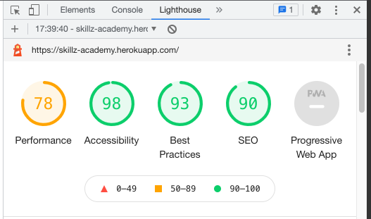

This document is made as a part of a testing section of the Skillz Academy website.
If you would like to view the README.md click **[here!](README.md)**

**For live website [click here](https://skillz-academy.herokuapp.com/)**

**For the GitHub repository [click here](https://github.com/rajendradanve/skillzacademy)**

# **Coding Test**

##  **HTML**

HTML is validated using online [HTML Validator](https://validator.w3.org/) tool.
The address is entered in the validator to check for errors.

Below are the results from the validator.

-   Home Page: Below is issues found which is coming from the base template.
    
    
    Updated id for the one of the navbardropdown.
-   Courses Page: No errors found
-   Courses Page with sorting, search: No error found
-   Courses Detail Page: Below errors were found.
    

    After checking it I found that errors are coming for the formated text entered in the text area where I used CKeditor library. 
    

    I have no control for this text ara as HTML for this is generated automatically. So I decided to ignore this error for now.

-   Login page: No errors found
-   Signup page: No errors found
-   Bag page: No errors found
-   Checkout Page: Below warning came. I ignored this warning.
    
-   Checkout Success Page: No errors found
-   Purchase History Page: No errors found
-   Contact Us Page: No errors found
-   Admin Page: No errors found
-   Add Course Page: No errors found
-   Discount Page: No errors found
-   Add Category: No errors found
-   Add Main Category: No errors found
-   Update Main Category: No errors found
-   Update Category: No errors found

## **CSS**

CSS is validated using the online [CSS Validator](https://validator.w3.org/) tool.

-   **base.css:** The CSS validator did not find any errors.
-   **checkout.css:** The CSS validator did not find any errors.
-   **add_courses.css:** The CSS validator did not find any errors.
-   **courses.css:** The CSS validator did not find any errors.
-   **home.css:** The CSS validator did not find any errors.
-   **my-courses.css:** The CSS validator did not find any errors.

## **Javascript**

Javascript is validated using the online [JSHint](https://jshint.com/) tool.

-   **stripe_elements.js:** The JSHint did not find any errors.
-   **courses.js:** The JSHint did not find any errors after adding the missing semicolon.

##  **Python**

All tests are run through [Python Validation Service](https://extendsclass.com/python-tester.html). Verified all views.py files and found no syntax errors. 

# **Manual Testing Based on User Stories**

## **General Testing**

- Chrome Developer Tools were used to test responsiveness on different screen sizes.
- Checked the website on different devices available to me which include desktops, mobile phones.
- Checked the website on different browsers such as Google Chrome, Safari, Edge, and Firefox.
- Asked friends and family members to go through the website to know the issues if any.
- Tested all links working properly.
- All CRUD functions were tested to make sure that they work as intended.

## **Non Register User**

- Verified that the home page, all courses page, courses, Sign up, and sign in pages are available for the non-registered users.
- Verified that the profile page and purchase history pages are not accessible to non-registered users and redirect to sign-in pages
- Checked that when the non-register user tries to register username will be unique.
- Checked that password is validated before the user is registered.

## **Register User**

-   Verified that the user correctly sign in after entering the correct username and password.
-   Verified that the register page is not available to sign-in users.
-   Verified that review form available to the sign-in user as each book page if the user did not submit reviews already.
-   Verified that the user who has reviewed the book gets the message that he already reviewed the book.
-   Verified that added book and profile pages are available for the sign-in page.
-   Verified that after adding book profile page shows book added by the user with the possibility to edit or delete the book.
-   Verified that the user who added the book shall be able to edit the book or delete it.
-   Verified that discount is calculated correctly for the registered users.
-   Verified that test payment is working fine by stripe and amount is calculated correctly.
-   Verified that order email coming correctly for the register user. 

    
## **Admin**

-   Verified that admin correctly sign in after entering the correct username and password.
-   Verified admin has access to all the courses pages.
-   Verified that admin can add course, course schedule
-   Verified that admin can add and edit the main category, category
-   Verified that admin can update course and course schedule
-   Verified that admin can activate or deactivate discount and also update.
-   Verified that admin getting email for all the forms sent via contact us page. 
-   Verfied that outdated course are not visible on the pages. 

# **Automated Testing**

* The Chrome extension [Responsive Viewer](https://chrome.google.com/webstore/detail/responsive-viewer/inmopeiepgfljkpkidclfgbgbmfcennb?hl=en) has been run and checked.

* Website tested on [Mobile-Friendly Test - Google Search Console](https://search.google.com/test/mobile-friendly) and validated correctly.

* Run style sheet code through [Autoprefixer CSS online](http://autoprefixer.github.io/) and pasted prefixed code back into the style sheet.

* Website performance is tested using [Google Lighhouse](https://developers.google.com/web/tools/lighthouse) and below are the screenshot from the result
   

Performance was low as the size of the images was too big. 
Reduced image sizes and uploaded again to improve the performance. There are more possibiilties to reduce size of the image to improve performance. But due to time contraint this was ignored for this time.  

## **Important Issues and  Solution**

-   Earlier I aimed to create only one page to add the course. While using modelformset_factory, I tried different ways to add courses and course schedules on one page. As this was a bit of advanced coding and was taking a lot of time. Finally, after some discussion with tutors, I decided to make 2 pages for adding the course. This is a bit extra work but due to time constraints for submitting the project, I decided to go with current solutions. 

-   I had trouble adjusting the layout for the webpage as some areas were going outside the boundaries and the page was scrolling horizontally. After some research I got a good tip from [stackoverflow link](https://stackoverflow.com/questions/18645870/responsive-website-how-to-get-rid-of-horizontal-scroll-bar). By using "* {border:1px solid red} " in the CSS I manage to figure out the issue area and fix it. 

- While implementing email functionality I figure out that even though payment is going correctly there are some issues with intent coming from the stripe. After some research, I figure out that the javascript file was not correctly getting some values and we're not sending it to the stripe handler. I manage to fix this and then worked with emails. 

- After deployment found that internal server error is coming for update course details. 
After some research it is found that I split 'courses/custom_widget_templates/custom_clearable_file_input.html' in 2 lines to avoid error of long lines in the widgets.py. So I kept this link in one line only. 

## **Known Bugs and Issues**

-   Admin management page buttons are not correctly aligned. I didn't fix those due to time constraints to submit the project.

-   Button shows for update course, update course schedule and delete score (when at admin login on course detail page) looks too big on the mobile phone version. I didn't fix those due to time constraints to submit the project.

- Messages for add or update discount is required to be sync correctly. It is not a issue as such but good to get correct message to admin.

- During the last part of testing I realize that if I put time as 12:00 pm heroku server showing it in text form as "noon". Due to time contraint I do not have possibility to fix this.
