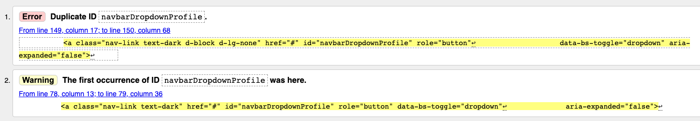
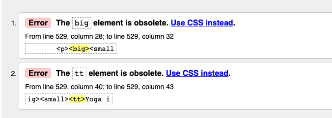
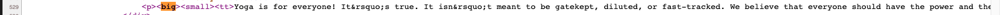
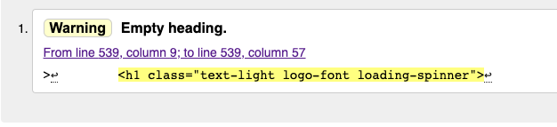

This document is made as a part of a testing section of the Skillz Academy website.
If you would like to the view the README.md click **[here!](README.md)

For live website [click here](https://skillz-academy.herokuapp.com/)

For the GitHub repository [click here](https://github.com/rajendradanve/skillzacademy)

# **Coding Test**

**HTML**
HTML is validated using online [HTML Validator](https://validator.w3.org/) tool.
Address is enteres in the validator to check for the errrors.

Below are the results from validator.

-   Home Page: Below issues found which is coming from the base template.
    
    
    Updated id for the one of the navbardropdown.
-   Courses Page: No errors found
-   Courses Page with sorting, search : No error found
-   Courses Detail Page: Below errors were found.
    

    After checking it I found that errors are coming for the formated text entered in the textarea where I used CKeditor librabry. 
    

    I have no control for this text ara as HTML for this is generated by automatrically. So I decided to ignore this error for now.

-   Login page: No errors found
-   Signup page: No errors found
-   Bag page : No errors found
-   Checkout Page - Below warning came. I ignored this warning.
    
-   Checkout Success Page: No errors found
-   Purchase History Page: No errors found
-   Contact Us Page: No errors found
-   
